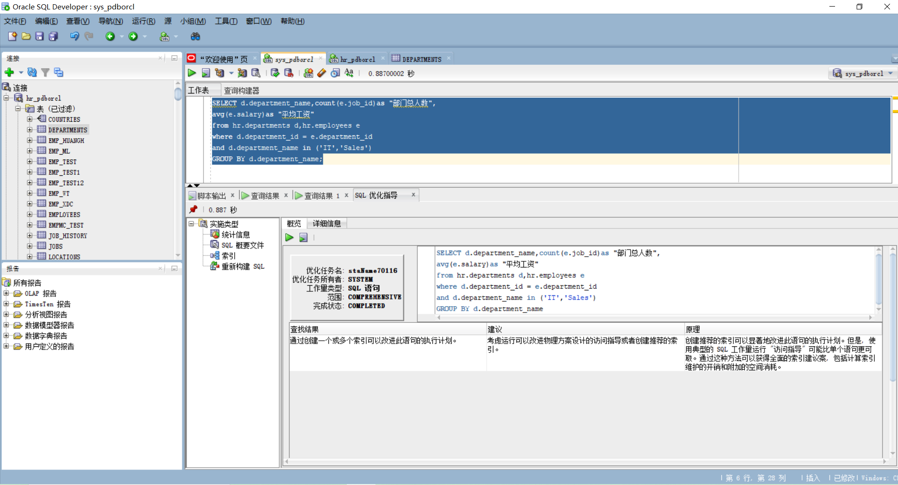
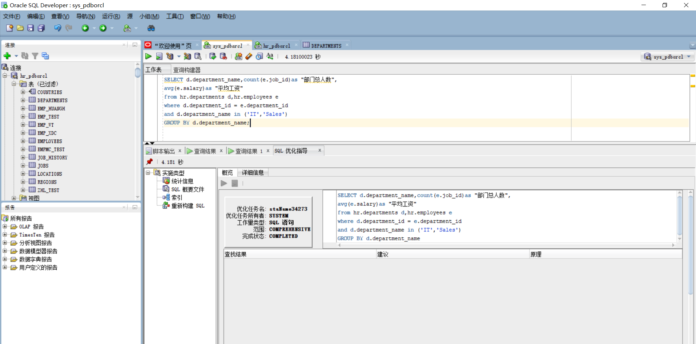
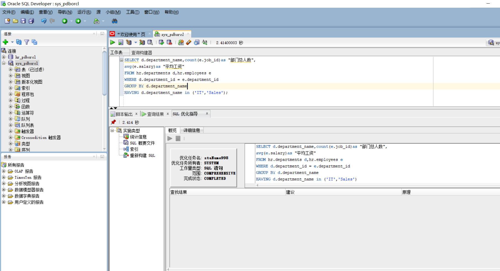
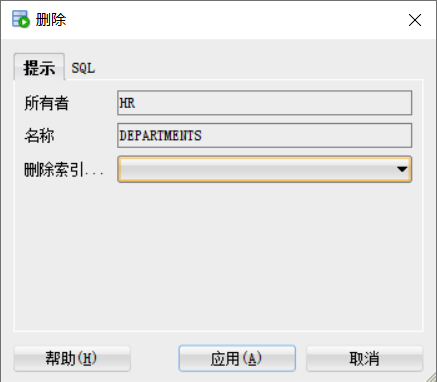
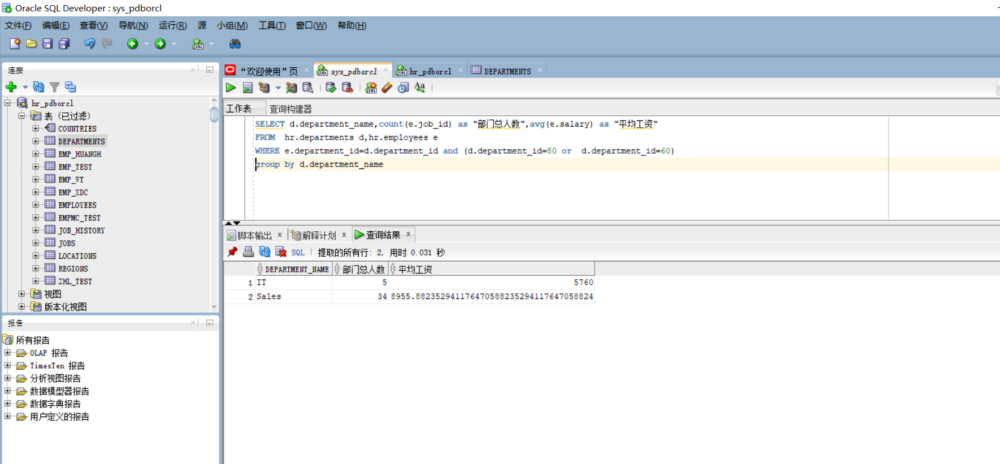
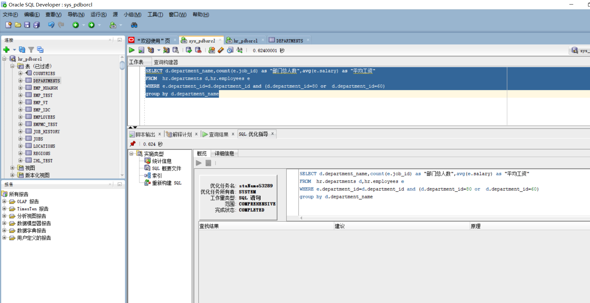

# 实验1：SQL语句的执行计划分析与优化指导

## 实验目的：

+ 分析SQL执行计划，执行SQL语句的优化指导。理解分析SQL语句的执行计划的重要作用。

## 实验内容：

- 对Oracle12c中的HR人力资源管理系统中的表进行查询与分析。
- 首先运行和分析教材中的样例：本训练任务目的是查询两个部门('IT'和'Sales')的部门总人数和平均工资，以下两个查询的结果是一样的。但效率不相同。
- 设计自己的查询语句，并作相应的分析，查询语句不能太简单。


+ ## 查询1：

```
set autotrace on

SELECT d.department_name,count(e.job_id)as "部门总人数",
avg(e.salary)as "平均工资"
from hr.departments d,hr.employees e
where d.department_id = e.department_id
and d.department_name in ('IT','Sales')
GROUP BY d.department_name;

```

+ 

+ 

+ 为其添加索引后，就没有了优化建议

+ 

  ## 查询2：

  ```
   set autotrace on
  
  SELECT d.department_name,count(e.job_id)as "部门总人数",
  avg(e.salary)as "平均工资"
  FROM hr.departments d,hr.employees e
  WHERE d.department_id = e.department_id
  GROUP BY d.department_name
  HAVING d.department_name in ('IT','Sales');
  
  ```

+ 第二个执行语句


+ 因为别人已经为它添加索引，所以没有优化建议

+ 

+ 

## sql查询3：

```SELECT d.department_name,count(e.job_id) as "部门总人数",avg(e.salary) as "平均工资"
FROM  hr.departments d,hr.employees e
WHERE e.department_id=d.department_id and (d.department_id=80 or  d.department_id=60) 
group by d.department_name
```






+ 无优化建议

  

## 分析和比较三个sql语句的执行计划


| 查询sql | consistent gets |
| :-----: | :-------------: |
|  sql1   |        9        |
|  sql2   |        8        |
|  sql3   |       13        |


一般来说consistent gets 越小越好，这三个查询中，sql2 > sql1 > sq3 ，则sql2查询语句最优。

执行计划的比较不单单从consistent gets考虑，应该综合考虑所有因素，比如递归调用、索引、全局等等！

但如果要说优先权的话，一般看consistent gets。
physical reads 和 consistent gets 通常是我们最关心的，如果physical reads 很高，说明要从磁盘请求大量的的数据到Buffer Cache 里，通常意味着系统里存在大量全表扫描的SQL语句，这会影响数据库的性能，因此尽量避免语句做全局扫描，对于全局扫描的SQL语句，建议增加相关的索引，优化SQL语句来解决。


