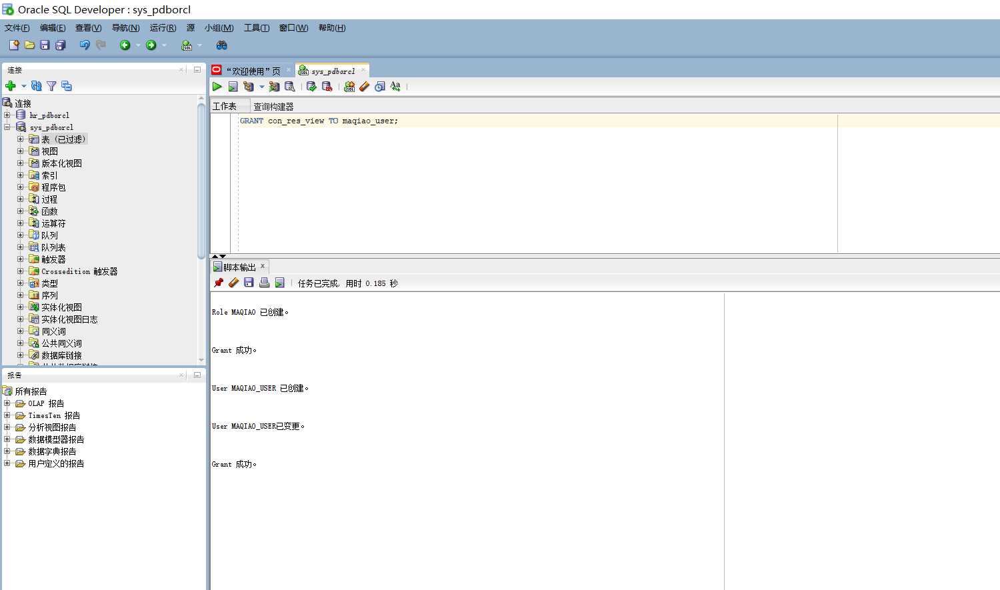
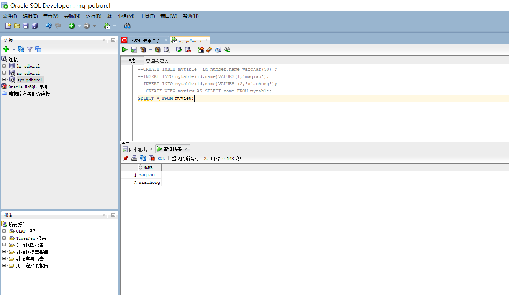
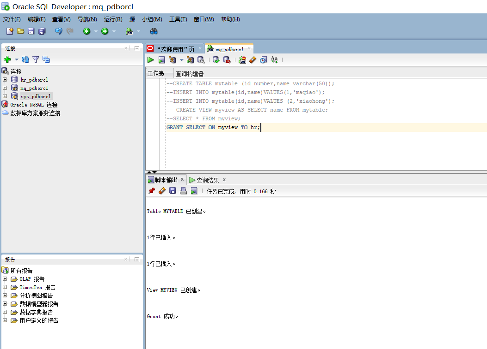
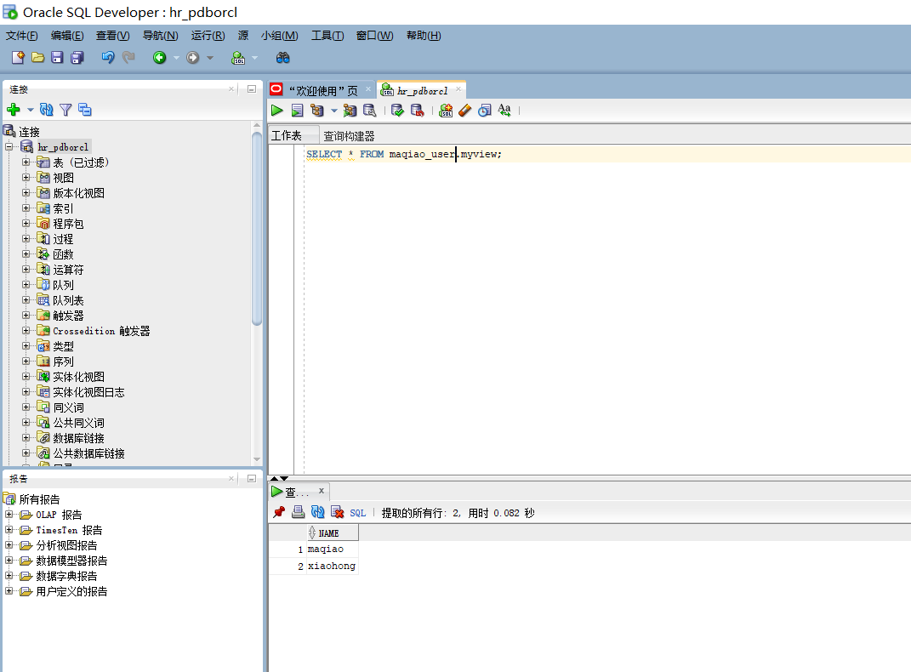
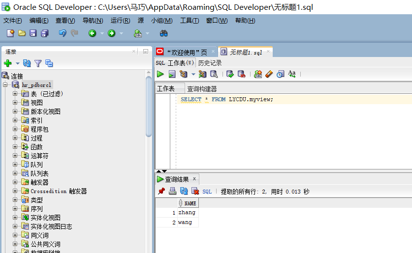
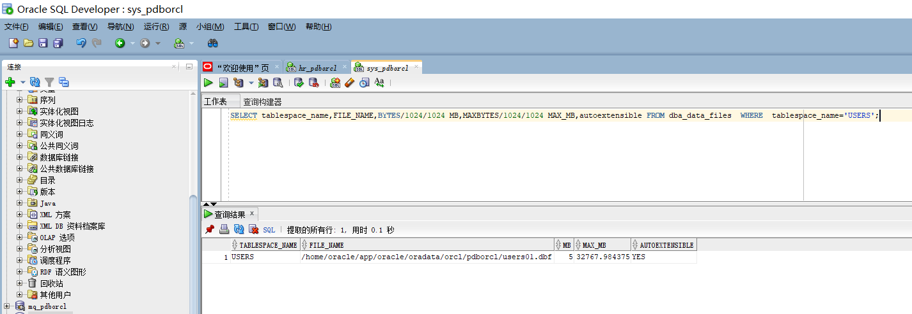
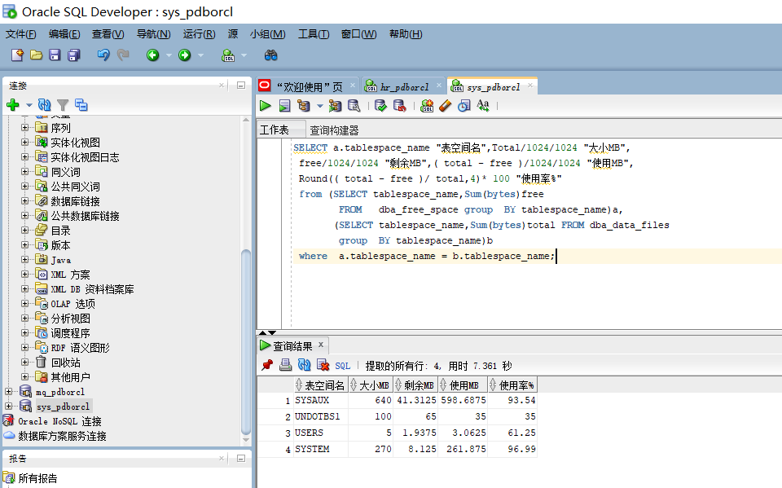

# 实验2：用户及权限管理

## 实验目的：

掌握用户管理、角色管理、权根维护与分配的能力，掌握用户之间共享对象的操作技能。

## 实验内容：

Oracle有一个开发者角色resource，可以创建表、过程、触发器等对象，但是不能创建视图。本训练要求：

在pdborcl插接式数据中创建一个新的本地角色con_res_view，该角色包含connect和resource角色，同时也包含CREATE VIEW权限，这样任何拥有con_res_view的用户就同时拥有这三种权限。
创建角色之后，再创建用户new_user，给用户分配表空间，设置限额为50M，授予con_res_view角色。
最后测试：用新用户new_user连接数据库、创建表，插入数据，创建视图，查询表和视图的数据。

### 第一步

以system登录到pdborcl，创建角色maqiao和用户maqiao_user，并授权和分配空间
```
$ sqlplus system/123@pdborcl
SQL> CREATE ROLE maqiao;
SQL> GRANT connect,resource,CREATE VIEW TO maqiao;
SQL> CREATE USER maqiao_user IDENTIFIED BY 123 DEFAULT TABLESPACE users TEMPORARY TABLESPACE temp;
SQL> ALTER USER maqiao_user QUOTA 50M ON users;
SQL> GRANT con_res_view TO maqiao_user;
SQL> exit
```



### 第2步
新用户maqiao_user连接到pdborcl，创建表mytable和视图myview，插入数据，最后将myview的SELECT对象权限授予hr用户。
```
$ sqlplus new_user/123@pdborcl
SQL> show user;
USER is "maqiao_user"
SQL> CREATE TABLE mytable (id number,name varchar(50));
SQL> INSERT INTO mytable(id,name)VALUES(1,'zhang');
SQL> INSERT INTO mytable(id,name)VALUES (2,'wang');
SQL> CREATE VIEW myview AS SELECT name FROM mytable;
SQL> SELECT * FROM myview;
SQL> GRANT SELECT ON myview TO hr;
Grant succeeded.
SQL>exit

```





### 第3步
用户hr连接到pdborcl，查询maqiao_user授予它的视图myview
```
$ sqlplus hr/123@pdborcl
SQL> SELECT * FROM new_user.myview;
SQL> exit
```



测试一下同学用户，查询LYCDU用户授予的视图myview


### 数据库和表空间占用分析

```
SQL>SELECT tablespace_name,FILE_NAME,BYTES/1024/1024 MB,MAXBYTES/1024/1024 MAX_MB,autoextensible FROM dba_data_files  WHERE  tablespace_name='USERS';
SQL>SELECT a.tablespace_name "表空间名",Total/1024/1024 "大小MB",
 free/1024/1024 "剩余MB",( total - free )/1024/1024 "使用MB",
 Round(( total - free )/ total,4)* 100 "使用率%"
 from (SELECT tablespace_name,Sum(bytes)free
        FROM   dba_free_space group  BY tablespace_name)a,
       (SELECT tablespace_name,Sum(bytes)total FROM dba_data_files
        group  BY tablespace_name)b
 where  a.tablespace_name = b.tablespace_name;
```




可以看到因为同学们都在表空间users存储表的数据，所以他的容量已经没剩多少了，使用率已经达到61.25%