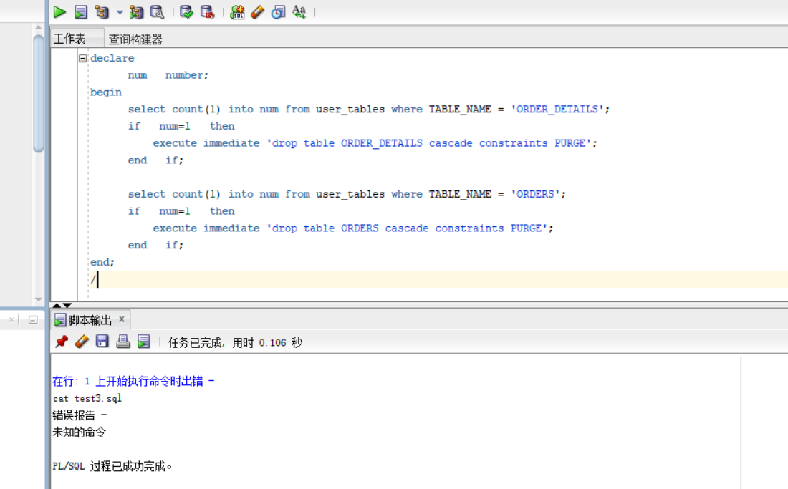
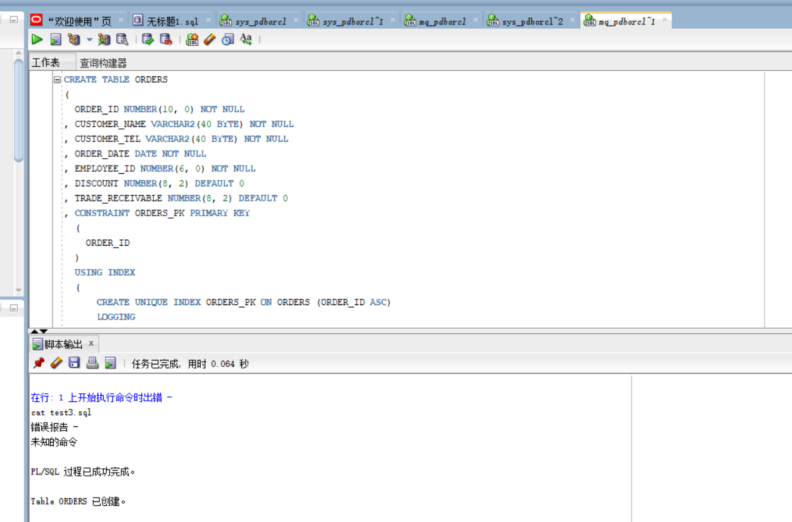
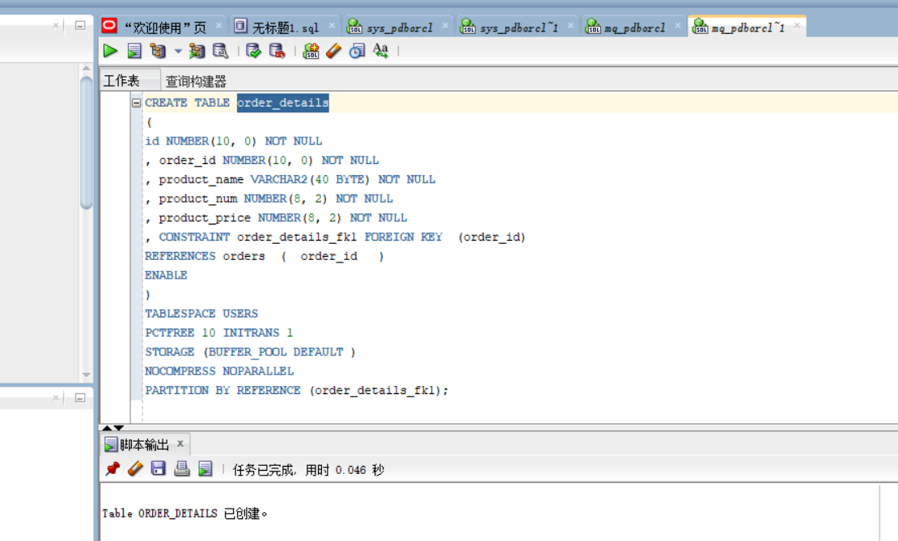
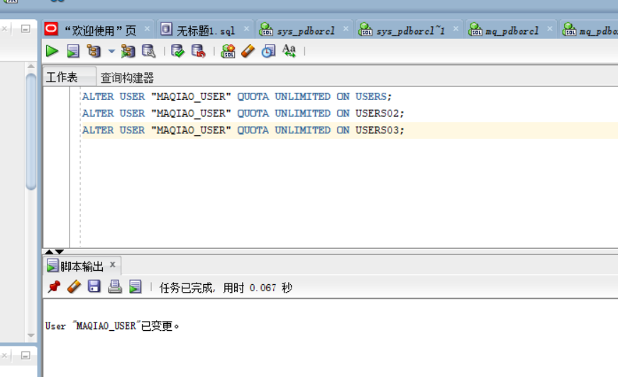
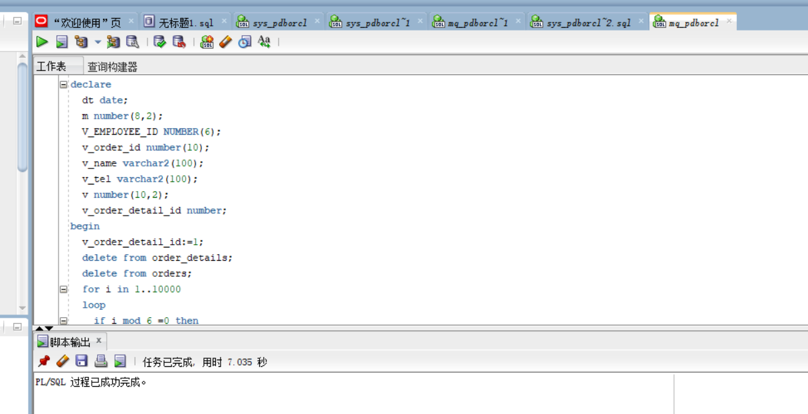
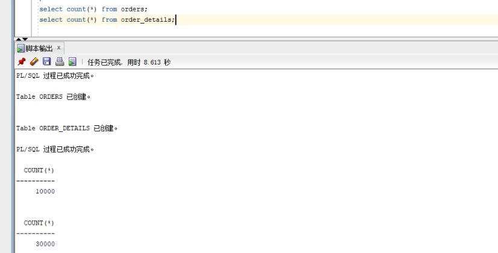
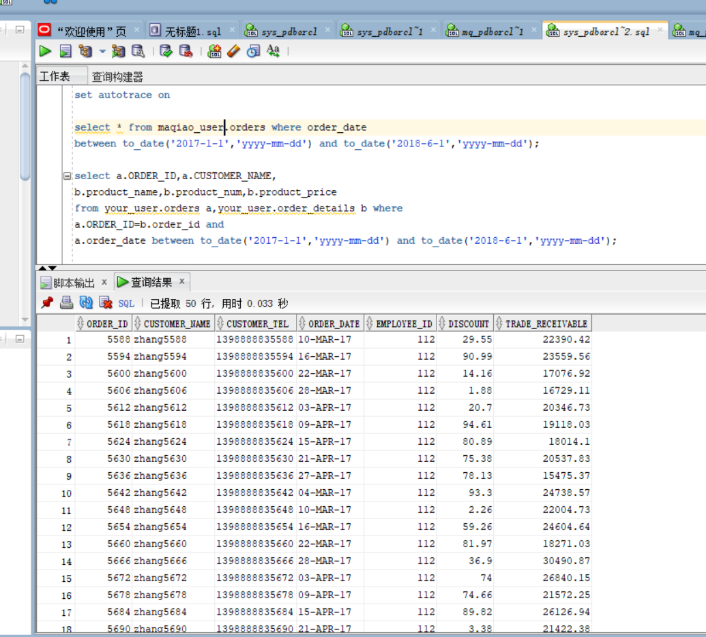

# 实验3：创建分区表

## 实验目的：

掌握分区表的创建方法，掌握各种分区方式的使用场景。

## 实验内容：

本实验使用3个表空间：USERS,USERS02,USERS03。在表空间中创建两张表：订单表(orders)与订单详表(order_details)。
**使用你自己的账号创建本实验的表**，表创建在上述3个分区，自定义分区策略。

你需要使用system用户给你自己的账号分配上述分区的使用权限。你需要使用system用户给你的用户分配可以查询执行计划的权限。

表创建成功后，插入数据，数据能并平均分布到各个分区。每个表的数据都应该大于1万行，对表进行联合查询。

写出插入数据的语句和查询数据的语句，并分析语句的执行计划。
进行分区与不分区的对比实验。

## 授权表空间


### 创建orders表

在主表orders和从表order_details之间建立引用分区 在study用户中创建两个表：orders（订单表）和order_details（订单详表），两个表通过列order_id建立主外键关联。orders表按范围分区进行存储，order_details使用引用分区进行存储。 创建orders表的部分语句是：





```
CREATE TABLE ORDERS
(
  ORDER_ID NUMBER(10, 0) NOT NULL
, CUSTOMER_NAME VARCHAR2(40 BYTE) NOT NULL
, CUSTOMER_TEL VARCHAR2(40 BYTE) NOT NULL
, ORDER_DATE DATE NOT NULL
, EMPLOYEE_ID NUMBER(6, 0) NOT NULL
, DISCOUNT NUMBER(8, 2) DEFAULT 0
, TRADE_RECEIVABLE NUMBER(8, 2) DEFAULT 0
, CONSTRAINT ORDERS_PK PRIMARY KEY
  (
    ORDER_ID
  )
  USING INDEX
  (
      CREATE UNIQUE INDEX ORDERS_PK ON ORDERS (ORDER_ID ASC)
      LOGGING
      TABLESPACE USERS
      PCTFREE 10
      INITRANS 2
      STORAGE
      (
        BUFFER_POOL DEFAULT
      )
      NOPARALLEL
  )
  ENABLE
)
TABLESPACE USERS
PCTFREE 10
INITRANS 1
STORAGE
(
  BUFFER_POOL DEFAULT
)
NOCOMPRESS
NOPARALLEL
PARTITION BY RANGE (ORDER_DATE)
(
  PARTITION PARTITION_2015 VALUES LESS THAN (TO_DATE(' 2016-01-01 00:00:00', 'SYYYY-MM-DD HH24:MI:SS', 'NLS_CALENDAR=GREGORIAN'))
  NOLOGGING
  TABLESPACE USERS
  PCTFREE 10
  INITRANS 1
  STORAGE
  (
    INITIAL 8388608
    NEXT 1048576
    MINEXTENTS 1
    MAXEXTENTS UNLIMITED
    BUFFER_POOL DEFAULT
  )
  NOCOMPRESS NO INMEMORY
, PARTITION PARTITION_2016 VALUES LESS THAN (TO_DATE(' 2017-01-01 00:00:00', 'SYYYY-MM-DD HH24:MI:SS', 'NLS_CALENDAR=GREGORIAN'))
  NOLOGGING
  TABLESPACE USERS
  PCTFREE 10
  INITRANS 1
  STORAGE
  (
    BUFFER_POOL DEFAULT
  )
  NOCOMPRESS NO INMEMORY
, PARTITION PARTITION_2017 VALUES LESS THAN (TO_DATE(' 2018-01-01 00:00:00', 'SYYYY-MM-DD HH24:MI:SS', 'NLS_CALENDAR=GREGORIAN'))
  NOLOGGING
  TABLESPACE USERS
  PCTFREE 10
  INITRANS 1
  STORAGE
  (
    BUFFER_POOL DEFAULT
  )
  NOCOMPRESS NO INMEMORY
, PARTITION PARTITION_2018 VALUES LESS THAN (TO_DATE(' 2019-01-01 00:00:00', 'SYYYY-MM-DD HH24:MI:SS', 'NLS_CALENDAR=GREGORIAN'))
  NOLOGGING
  TABLESPACE USERS02
  PCTFREE 10
  INITRANS 1
  STORAGE
  (
    BUFFER_POOL DEFAULT
  )
  NOCOMPRESS NO INMEMORY
, PARTITION PARTITION_2019 VALUES LESS THAN (TO_DATE(' 2020-01-01 00:00:00', 'SYYYY-MM-DD HH24:MI:SS', 'NLS_CALENDAR=GREGORIAN'))
  NOLOGGING
  TABLESPACE USERS02
  PCTFREE 10
  INITRANS 1
  STORAGE
  (
    BUFFER_POOL DEFAULT
  )
  NOCOMPRESS NO INMEMORY
, PARTITION PARTITION_2020 VALUES LESS THAN (TO_DATE(' 2021-01-01 00:00:00', 'SYYYY-MM-DD HH24:MI:SS', 'NLS_CALENDAR=GREGORIAN'))
  NOLOGGING
  TABLESPACE USERS02
  PCTFREE 10
  INITRANS 1
  STORAGE
  (
    BUFFER_POOL DEFAULT
  )
  NOCOMPRESS NO INMEMORY
, PARTITION PARTITION_2021 VALUES LESS THAN (TO_DATE(' 2022-01-01 00:00:00', 'SYYYY-MM-DD HH24:MI:SS', 'NLS_CALENDAR=GREGORIAN'))
  NOLOGGING
  TABLESPACE USERS03
  PCTFREE 10
  INITRANS 1
  STORAGE
  (
    BUFFER_POOL DEFAULT
  )
  NOCOMPRESS NO INMEMORY
);
```




### 创建order_details


```
CREATE TABLE order_details
(
id NUMBER(10, 0) NOT NULL
, order_id NUMBER(10, 0) NOT NULL
, product_name VARCHAR2(40 BYTE) NOT NULL
, product_num NUMBER(8, 2) NOT NULL
, product_price NUMBER(8, 2) NOT NULL
, CONSTRAINT order_details_fk1 FOREIGN KEY  (order_id)
REFERENCES orders  (  order_id   )
ENABLE
)
TABLESPACE USERS
PCTFREE 10 INITRANS 1
STORAGE (BUFFER_POOL DEFAULT )
NOCOMPRESS NOPARALLEL
PARTITION BY REFERENCE (order_details_fk1);

```



### 授权




### 插入数据

```
declare
  dt date;
  m number(8,2);
  V_EMPLOYEE_ID NUMBER(6);
  v_order_id number(10);
  v_name varchar2(100);
  v_tel varchar2(100);
  v number(10,2);
  v_order_detail_id number;
begin
  v_order_detail_id:=1;
  delete from order_details;
  delete from orders;
  for i in 1..10000
  loop
    if i mod 6 =0 then
      dt:=to_date('2015-3-2','yyyy-mm-dd')+(i mod 60); --PARTITION_2015
    elsif i mod 6 =1 then
      dt:=to_date('2016-3-2','yyyy-mm-dd')+(i mod 60); --PARTITION_2016
    elsif i mod 6 =2 then
      dt:=to_date('2017-3-2','yyyy-mm-dd')+(i mod 60); --PARTITION_2017
    elsif i mod 6 =3 then
      dt:=to_date('2018-3-2','yyyy-mm-dd')+(i mod 60); --PARTITION_2018
    elsif i mod 6 =4 then
      dt:=to_date('2019-3-2','yyyy-mm-dd')+(i mod 60); --PARTITION_2019
    else
      dt:=to_date('2020-3-2','yyyy-mm-dd')+(i mod 60); --PARTITION_2020
    end if;
    V_EMPLOYEE_ID:=CASE I MOD 6 WHEN 0 THEN 11 WHEN 1 THEN 111 WHEN 2 THEN 112
                                WHEN 3 THEN 12 WHEN 4 THEN 121 ELSE 122 END;
    --插入订单
    v_order_id:=i;
    v_name := 'aa'|| 'aa';
    v_name := 'zhang' || i;
    v_tel := '139888883' || i;
    insert /*+append*/ into ORDERS (ORDER_ID,CUSTOMER_NAME,CUSTOMER_TEL,ORDER_DATE,EMPLOYEE_ID,DISCOUNT)
      values (v_order_id,v_name,v_tel,dt,V_EMPLOYEE_ID,dbms_random.value(100,0));
    --插入订单y一个订单包括3个产品
    v:=dbms_random.value(10000,4000);
    v_name:='computer'|| (i mod 3 + 1);
    insert /*+append*/ into ORDER_DETAILS(ID,ORDER_ID,PRODUCT_NAME,PRODUCT_NUM,PRODUCT_PRICE)
      values (v_order_detail_id,v_order_id,v_name,2,v);
    v:=dbms_random.value(1000,50);
    v_name:='paper'|| (i mod 3 + 1);
    v_order_detail_id:=v_order_detail_id+1;
    insert /*+append*/ into ORDER_DETAILS(ID,ORDER_ID,PRODUCT_NAME,PRODUCT_NUM,PRODUCT_PRICE)
      values (v_order_detail_id,v_order_id,v_name,3,v);
    v:=dbms_random.value(9000,2000);
    v_name:='phone'|| (i mod 3 + 1);

    v_order_detail_id:=v_order_detail_id+1;
    insert /*+append*/ into ORDER_DETAILS(ID,ORDER_ID,PRODUCT_NAME,PRODUCT_NUM,PRODUCT_PRICE)
      values (v_order_detail_id,v_order_id,v_name,1,v);
    --在触发器关闭的情况下，需要手工计算每个订单的应收金额：
    select sum(PRODUCT_NUM*PRODUCT_PRICE) into m from ORDER_DETAILS where ORDER_ID=v_order_id;
    if m is null then
     m:=0;
    end if;
    UPDATE ORDERS SET TRADE_RECEIVABLE = m - discount WHERE ORDER_ID=v_order_id;
    IF I MOD 1000 =0 THEN
      commit; --每次提交会加快插入数据的速度
    END IF;
  end loop;
end;
/
```




### 查询数据条数

```
select count(*) from orders;
select count(*) from order_details;
```




### 使用sys账号查询信息

```
set autotrace on

select * from dys.orders where order_date
between to_date('2017-1-1','yyyy-mm-dd') and to_date('2018-6-1','yyyy-mm-dd');

select a.ORDER_ID,a.CUSTOMER_NAME,
b.product_name,b.product_num,b.product_price
from dys.orders a,dys.order_details b where
a.ORDER_ID=b.order_id and
a.order_date between to_date('2017-1-1','yyyy-mm-dd') and to_date('2018-6-1','yyyy-mm-dd');
```




# oracle分区优缺点

当表中的数据量不断增大，查询数据的速度就会变慢，应用程序的性能就会下降，这时就应该考虑对表进行分区。表进行分区后，逻辑上表仍然是一张完整的表，只是将表中的数据在物理上存放到多个表空间(物理文件上)，这样查询数据时，不至于每次都扫描整张表。   

 **表分区的具体作用**  

Oracle的表分区功能通过改善可管理性、性能和可用性，从而为各式应用程序带来了极大的好处。通常，分区可以使某些查询以及维护操作的性能大大提高。此外,分区还可以极大简化常见的管理任务，分区是构建千兆字节数据系统或超高可用性系统的关键工具。      

**分区功能能够将表、索引或索引组织表进一步细分为段，这些数据库对象的段叫做分区**。每个分区有自己的名称，还可以选择自己的存储特性。从数据库管理员的角度来看，一个分区后的对象具有多个段，这些段既可进行集体管理，也可单独管理，这就使数据库管理员在管理分区后的对象时有相当大的灵活性。但是，从应用程序的角度来看，分区后的表与非分区表完全相同，使用 SQL DML 命令访问分区后的表时，无需任何修改。

 **什么时候使用分区表：**

1、表的大小超过2GB。  

2、表中包含历史数据，新的数据被增加都新的分区中。   

**表分区优点：**   

1、改善查询性能：对分区对象的查询可以仅搜索自己关心的分区，提高检索速度。

2、增强可用性：如果表的某个分区出现故障，表在其他分区的数据仍然可用；

3、维护方便：如果表的某个分区出现故障，需要修复数据，只修复该分区即可；  

4、均衡I/O：可以把不同的分区映射到磁盘以平衡I/O，改善整个系统性能。

**表分区缺点：**   

分区表相关：已经存在的表没有方法可以直接转化为分区表。不过 Oracle 提供了在线重定义表的功能。