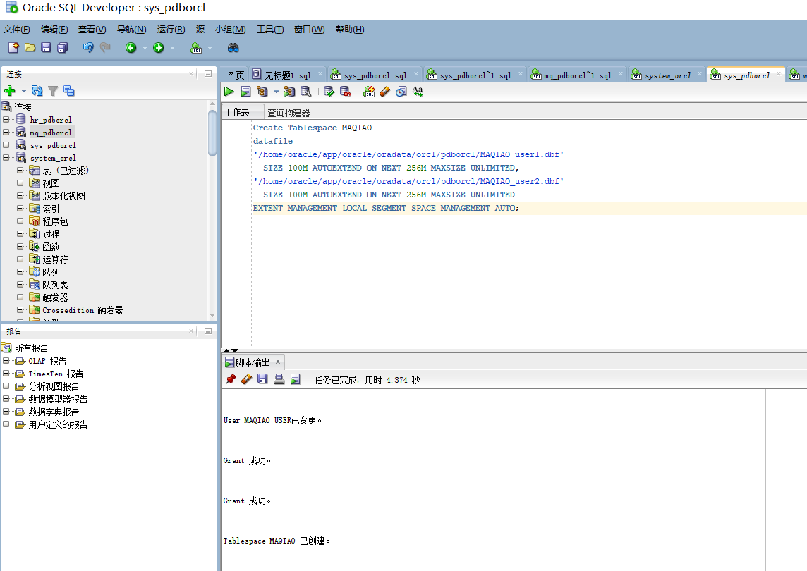
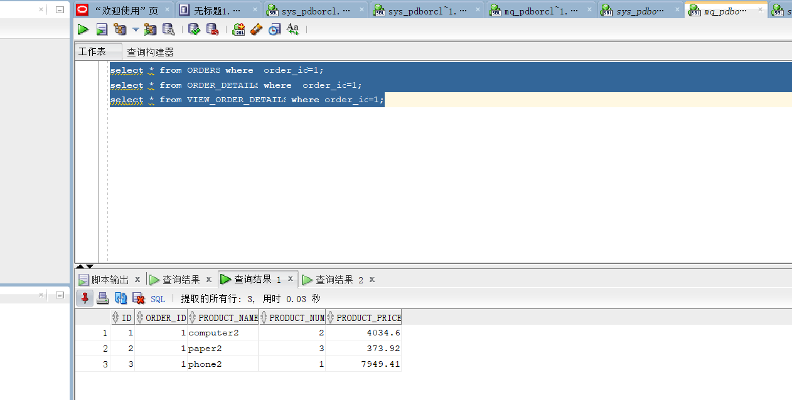
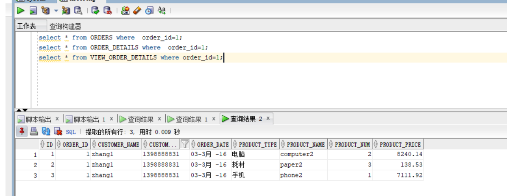
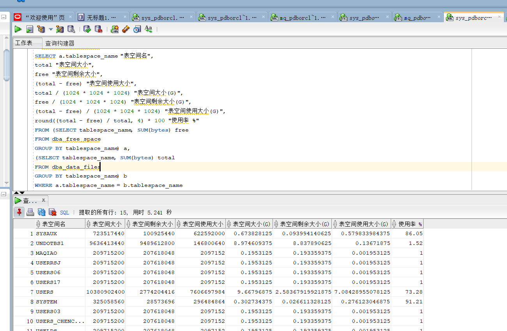

# 实验4：对象管理

## 实验目的：

了解Oracle表和视图的概念，学习使用SQL语句Create Table创建表，学习Select语句插入，修改，删除以及查询数据，学习使用SQL语句创建视图，学习部分存储过程和触发器的使用。

## - 实验场景：

假设有一个生产某个产品的单位，单位接受网上订单进行产品的销售。通过实验模拟这个单位的部分信息：员工表，部门表，订单表，订单详单表。

### 授权

```
ALTER USER MAQIAO_USER QUOTA UNLIMITED ON USERS;
ALTER USER MAQIAO_USER QUOTA UNLIMITED ON USERS02;
ALTER USER MAQIAO_USER ACCOUNT UNLOCK;

GRANT "CONNECT" TO MAQIAO_USER WITH ADMIN OPTION;
GRANT "RESOURCE" TO MAQIAO_USER WITH ADMIN OPTION;
ALTER USER  MAQIAO_USER DEFAULT ROLE "CONNECT","RESOURCE";

GRANT CREATE VIEW TO MAQIAO_USER WITH ADMIN OPTION;
GRANT CREATE SESSION TO  MAQIAO_USER;
GRANT CREATE TABLE TO  MAQIAO_USER;
GRANT CREATE TABLESPACE TO  MAQIAO_USER;
GRANT CREATE VIEW TO  MAQIAO_USER;
```


### 增加一个表空间MAQIAO

```
Create Tablespace MAQIAO
datafile
'/home/oracle/app/oracle/oradata/orcl/pdborcl/MAQIAO_user1.dbf'
  SIZE 100M AUTOEXTEND ON NEXT 256M MAXSIZE UNLIMITED,
'/home/oracle/app/oracle/oradata/orcl/pdborcl/MAQIAO_user2.dbf'
  SIZE 100M AUTOEXTEND ON NEXT 256M MAXSIZE UNLIMITED
EXTENT MANAGEMENT LOCAL SEGMENT SPACE MANAGEMENT AUTO;
```



### 创建用户MAQIAO

```
 CREATE USER STUDY_MAQIAO IDENTIFIED BY 123
DEFAULT TABLESPACE "USERS"
TEMPORARY TABLESPACE "TEMP";
```


### 授权


### DDL for Table DEPARTMENTS


### DDL for Table EMPLOYEES,PRODUCTS


### DDL for Table ORDER_ID_TEMP


### DDL for Table ORDERS


### 创建索引


### 创建3个触发器


### 插入数据


**--批量插入订单数据，注意ORDERS.TRADE_RECEIVABLE（订单应收款）的自动计算,注意插入数据的速度**
**--2千万条记录，插入的时间是：18100秒（约5小时）**


--最后动态增加一个PARTITION_BEFORE_2018分区：


### 测试





**递归查询某个员工及其所有下属，子下属员工。**


**--特殊查询语句：**
**--查询分区表情况:**


查询一个分区中的数据


--收集表的统计信息dbms_stats.gather_table_stats
--也可以使用ANALYZE TABLE TableName COMPUTE STATISTICS; 但推荐使用dbms_stats.gather_table_stats
--分析单个表：
--exec dbms_stats.gather_table_stats(user,'ORDERS',cascade=>true); --cascade=true表示同时收集索引的信息
--exec dbms_stats.gather_table_stats(user,'ORDER_DETAILS',cascade=>true);
--统计用户的所有表：

```
exec dbms_stats.gather_schema_stats(User,estimate_percent=>100,cascade=> TRUE); --estimate_percent采样行的百分比
```

--统计完成后，查询表的统计信息：

```
select table_name,tablespace_name,num_rows from user_tables where table_name='ORDERS';
select table_name,tablespace_name,num_rows from user_tables where table_name='ORDER_DETAILS';
select * from orders where order_id=1300;
select * from ORDER_DETAILS where order_id=1300;
select * from orders where customer_name='zhang133000';
select * from orders where order_date<to_date('2016-01-01','yyyy-mm-dd');
```


查看表空间使用大小



### 实验总结

通过本次实验，我了解Oracle表和视图的概念，视图是基于 SQL 语句的结果集的可视化的表，即视图是一个虚拟存在的表，可以包含表的全部或者部分记录，也可以由一个表或者多个表来创建。使用视图就可以不用看到数据表中的所有数据，而是只想得到所需的数据。当我们创建一个视图的时候，实际上是在数据库里执行了SELECT语句，SELECT语句包含了字段名称、函数、运算符，来给用户显示数据。 

视图的数据是依赖原来表中的数据的，所以原来的表的数据发生了改变，那么显示的视图的数据也会跟着改变，例如向数据表中插入数据，那么在查看视图的时候，会发现视图中也被插入了同样的数据。视图实际上是由预定义的查询形式的表所组成的。本次实验中，学习和使用了SQL语句Create Table创建表，学习Select语句插入，修改，删除以及查询数据，学习使用SQL语句创建视图，学习了存储过程和触发器的使用。让我对Oracle数据库有了更深刻的认识。