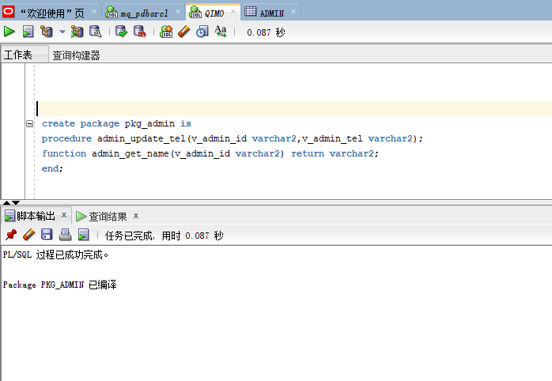
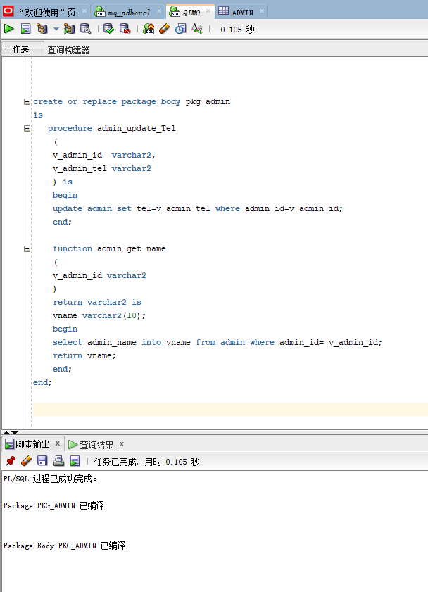
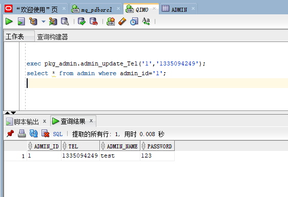

#   基于Oracle的日用品商城的数据库设计  

### 成都大学计算机学院

| 学号         | 班级      | 姓名 | 照片                |
| ------------ | --------- | ---- | ------------------- |
| 201810601109 | 2018级2班 | 马巧 |  |

## 1.概述

+ 基于Oracle的日用品商城的数据库设计。前端采用小程序搭建，后台采用SpringBoot框架和oracle数据库组合实现。

- 本系统有3种角色，管理员，用户和游客。
- 游客可以对商品信息进行浏览、查询，但是无法购买。
- 用户可以浏览、查询、购买、询问、退购商品。
- 管理员对商品数量、价格、种类等信息进行管理。
- 如果商城库房商品不足，根据数量提示管理员进行线下添置商品。

## 2.系统总体结构


## 3.日用品商城ER模型


图1-1,管理员(admin)包括管理员id（admin_id）、联系电话（tel）、管理员名（admin_username）和管理员密码(password)


图1-2,日用品（goods）包括日用品id（goods _id）、日用品图片（image）、日用品名称（name）、日用品简介（Introduction）、日用品价格（price）。管理员可对日用品的种类和数量进行增删查改。


图1-3,  用户（user）包括用户id（user_id）、用户名（username）、联系电话（tel）、用户地址（address）。在每次用户下单后，订单上面需要根据用户id或是用户名对该订单的详细记录写进数据库。


图1-4,会员（member）包括会员id（member_id）、用户id（user_id）、会员购买时间（member_start）、会员截止时间（member_end）、购买时长（member_time）。可以根据会员的结束时间来提醒用户是否续费，根据购买时长来计算会员的截止时间。


图1-5,订单（order）包括订单编号（order_id）、用户id（user_id）、日用品id（goods _id）、日用品数量（goods_nums）、用户地址（address）、下单时间（order_time）、订单总金额（total_price）。


## 实体关系图


图1-6,管理员和日用品的关系是一对多的关系，在这个商城系统，只有一个管理员账号，每个员工可以登录这个管理员账号对日用品信息进行增删查改。


图1-7，用户和日用品的关系是多对多，一个用户可以购买多个日用品，同一种日用品可以被多个用户购买。


图1-8，用户和会员的关系是多对一，一个用户只能购买一个会员。


图1-9，用户和订单的关系是多对多，每个人的下单没有限制，一个人可以下多个订单。因为一个用户的下单地址可能不一样，所以在这里每一个订单都必须绑定自己的订单地址。


图1-10，日用品商城ER模型总图。

## 3.表设计

**ADMIN表**

| **字段名** | **数据类型** | **可以为空** | 说明           | **主键，外键** |
| ---------- | ------------ | ------------ | -------------- | -------------- |
| admin_id   | varchar      | no           | 管理员ID       | 主键           |
| tel        | varchar      | no           | 管理员联系方式 |                |
| admin_name | varchar      | no           | 管理员名       |                |
| password   | varchar      | no           | 管理员密码     |                |

**USERS表**

| **字段名** | **数据类型** | **可以为空** | 说明         | **主键，外键** |
| ---------- | ------------ | ------------ | ------------ | -------------- |
| user_id    | varchar      | no           | 用户ID       | 主键           |
| tel        | varchar      | no           | 用户联系方式 |                |
| username   | varchar      | no           | 用户名       |                |
| address    | varchar      | yes          | 用户地址     | 可以有多个地址 |

 

**GOODS表**

| **字段名**  | **数据类型** | **可以为空** | 说明         | **主键，外键** |
| ----------- | ------------ | ------------ | ------------ | -------------- |
| goods_id    | varchar      | no           | 日用品ID     | 主键           |
| goods_image | varchar      | no           | 日用品图片   |                |
| goods_name  | varchar      | no           | 日用品名称   |                |
| introduce   | varchar      | yes          | 日用品简介   | 可以为空       |
| price       | float        | no           | 日用品价格   |                |
| type        | varchar      | no           | 日用品的类型 | 种类           |

**MEMBER表**

| **字段名**   | **数据类型** | **可以为空** | 说明         | **主键，外键** |
| ------------ | ------------ | ------------ | ------------ | -------------- |
| member_id    | varchar      | no           | 会员ID       | 主键           |
| member_start | date         | no           | 会员开始时间 |                |
| member_end   | date         | no           | 会员结束时间 |                |
| member_time  | varchar      | no           | 会员总时间   |                |
| user_id      | varchar      | no           | 用户id       | 外键           |

**ORDER表**

| **字段名**  | **数据类型** | **可以为空** | 说明       | **主键，外键** |
| ----------- | ------------ | ------------ | ---------- | -------------- |
| order_id    | varchar      | no           | 订单ID     | 主键           |
| goods_id    | varchar      | no           | 商品ID     | 外键           |
| user_id     | varchar      | no           | 用户ID     | 外键           |
| username    | varchar      | no           | 用户名     |                |
| address     | varchar      | no           | 订单地址   |                |
| order_time  | date         | no           | 下单时间   |                |
| total_price | float        | no           | 订单总金额 |                |
| goods_nums  | Int          | no           | 商品数量   |                |

 

## 4.表空间设计

SYSTEM用户创建的一个表空间MAQIAO的命令，注意给MAQIAO表空间分配了两个数据文件：pdbtest_MAQIAO1.dbf和pdbtest_MAQIAO2.dbf，这两个数据文件初始大小都是100M，所以表空间的初始大小是200M。

### 5.创建表空间

```
create tablespace MAQIAO
datafile
'/home/oracle/app/oracle/oradata/orcl/pdborcl/pdbtest_MAQIAO1.dbf'
size 100M AUTOEXTEND ON NEXT 256M MAXSIZE UNLIMITED,
'/home/oracle/app/oracle/oradata/orcl/pdborcl/pdbtest_MAQIAO2.dbf'
size 100M AUTOEXTEND ON NEXT 256M MAXSIZE UNLIMITED
EXTENT MANAGEMENT LOCAL SEGMENT SPACE MANAGEMENT AUTO;
```


### 6.创建用户并授权

```
--创建用户
create user MAQIAO_U
IDENTIFIED by 123
default tablespace MAQIAO;

--为用户授权
-- ROLES
GRANT "CONNECT" TO MAQIAO_U WITH ADMIN OPTION;
GRANT "RESOURCE" TO MAQIAO_U WITH ADMIN OPTION;
ALTER USER MAQIAO_U DEFAULT ROLE "CONNECT","RESOURCE";
-- SYSTEM PRIVILEGES
GRANT CREATE VIEW TO MAQIAO_U WITH ADMIN OPTION;


--切换到自己的用户


--给用户MAQIAO修改用户表空间和临时表空间
alter  user MAQIAO  DEFAULT TABLESPACE "USERS" TEMPORARY TABLESPACE "TEMP";
-- QUOTAS
ALTER USER MAQIAO QUOTA UNLIMITED ON USERS;
ALTER USER MAQIAO QUOTA UNLIMITED ON MAQIAO;

```


### 7.创建表

```
CREATE TABLE GOODS(
goods_id VARCHAR2(10) PRIMARY KEY NOT NULL,
goods_image VARCHAR2(14) NOT NULL,
goods_name VARCHAR2(13) NOT NULL,
introduce VARCHAR2(14) NOT NULL,
price FLOAT NOT NULL,
type VARCHAR2(14) NOT NULL
);

CREATE TABLE USERS
(
user_id VARCHAR2(10) PRIMARY KEY NOT NULL,
tel VARCHAR2(10) NOT NULL,
username VARCHAR2(10) NOT NULL,
address VARCHAR2(10) 
);


CREATE TABLE ADMIN
(
admin_id VARCHAR2(10) PRIMARY KEY NOT NULL,
tel VARCHAR2(10) NOT NULL,
admin_name VARCHAR2(10) NOT NULL,
password VARCHAR2(10) NOT NULL
);


CREATE TABLE MEMBER
(
member_id VARCHAR2(10) PRIMARY KEY NOT NULL,
member_start  DATE NOT NULL,
member_end DATE NOT NULL ,
member_time VARCHAR2(10) NOT NULL,
user_id VARCHAR2(10) NOT NULL,
 constraint fk_member_user_id foreign key (user_id) references USERS(user_id)
);


create table ORDERS 
(
order_id  VARCHAR2(10) PRIMARY KEY NOT NULL,
goods_nums NUMBER(2) NOT NULL,
address  VARCHAR2(10) NOT NULL,
order_time DATE NOT NULL,
total_price FLOAT NOT NULL,
goods_id VARCHAR2(10) NOT NULL,
user_id VARCHAR2(10) NOT NULL
)
TABLESPACE USERS 
PCTFREE 10 INITRANS 1 
STORAGE (   BUFFER_POOL DEFAULT ) 
NOCOMPRESS NOPARALLEL 
PARTITION BY RANGE (order_time) 
(
 PARTITION PARTITION_BEFORE_2020 VALUES LESS THAN (
 TO_DATE(' 2020-01-01 00:00:00', 'SYYYY-MM-DD HH24:MI:SS', 
 'NLS_CALENDAR=GREGORIAN')) 
 NOLOGGING 
 TABLESPACE USERS 
 PCTFREE 10 
 INITRANS 1 
 STORAGE 
( 
 INITIAL 8388608 
 NEXT 1048576 
 MINEXTENTS 1 
 MAXEXTENTS UNLIMITED 
 BUFFER_POOL DEFAULT 
) 
NOCOMPRESS NO INMEMORY  
, PARTITION PARTITION_BEFORE_2021 VALUES LESS THAN (
TO_DATE(' 2021-01-01 00:00:00', 'SYYYY-MM-DD HH24:MI:SS', 
'NLS_CALENDAR=GREGORIAN')) 
NOLOGGING 
);

--添加约束
alter table ORDERS add constraint fk_user_good foreign key (goods_id) references GOODS(goods_id) ;
alter table ORDERS add constraint fk_user foreign key (user_id) references USERS(user_id) ;


```


### 8.向基础表插入数据,(给orders要引用的外键的基础表加数据)

```
insert into USERS values('1','0987690','tom','cdu-10she');
insert into USERS values('2','0187190','lili','cdu-8she');

insert into GOODS values('1','1.jpg','Wash liquid','wash cloth',16.0,'wash');
insert into GOODS values('2','2.jpg','Hair shampoo','wash hair',23.0,'wash');

```


### 9.向订单表中加入50000条数据

```
declare
  dt date;
BEGIN
  for i IN 1..100 LOOP
    INSERT INTO orders (order_id,goods_nums,address,order_time,total_price,goods_id,user_id)
  VALUES ('001'+i,2,'cdu-15she',to_date('2016-3-2','yyyy-mm-dd'),100,'1','1');
  END LOOP;
END;

```


### 创建索引

```
create index info_user_id on orders (user_id);
```


### 10.创建触发器

```
CREATE OR REPLACE TRIGGER cascade_trigger
AFTER UPDATE OF user_id ON users
FOR EACH ROW
BEGIN
  UPDATE MEMBER SET user_id=:new.user_id WHERE user_id=:old.user_id;
END;
```


### 11.创建序列

```
CREATE SEQUENCE orders_sequence
INCREMENT BY 1   
START WITH 1     
NOMAXVALUE       
NOCYCLE          
CACHE 10;
```


### 12.创建存储过程

```
create or replace procedure update_admin
(
v_admin_id  varchar2,
v_admin_name  varchar2
) is
begin
update ADMIN set admin_name=v_admin_name where admin_id=v_admin_id;  
end update_admin;

--测试
INSERT INTO ADMIN VALUES ('1','10087','zhangsan','123');
exec  update_admin('1','test');
select * from ADMIN;

```


```
--测试存储过程：
INSERT INTO ADMIN VALUES ('1','10087','zhangsan','123');
exec  update_admin('1','test');
select * from ADMIN;

```


创建一个存储过程，修改admin表中的tel字段。

```
create or replace procedure update_adminTel
(
v_admin_id  varchar2,
v_admin_tel varchar2
) is
begin
update admin set tel=v_admin_tel where admin_id=v_admin_id;  
end update_adminTel;

```


```
--测试存储过程：
select * from admin;
exec  update_adminTel('001','123456');
select * from admin;

```


```
--创建一个存储过程，查看admin表中根据admin_id查询出admin的name
create or replace procedure admin_out_name
 (
 v_admin_id in VARCHAR2,
 v_name out VARCHAR2
 ) is
vname  VARCHAR2(10) ;
 begin
 select admin_name into vname from admin where admin_id=v_admin_id;
 v_name:=vname;
 end;

```


```
var vname VARCHAR2
exec  admin_out_name('1',:vname);

```


### 13.创建程序包

```
 create package pkg_admin is
 procedure admin_update_tel(v_admin_id varchar2,v_admin_tel varchar2);
 function admin_get_name(v_admin_id varchar2) return varchar2;
 end;
```




```
--创建程序包和包体
create or replace package body pkg_admin
is
   procedure admin_update_Tel
    (
    v_admin_id  varchar2,
    v_admin_tel varchar2
    ) is
    begin
    update admin set tel=v_admin_tel where admin_id=v_admin_id;  
    end;
    
    function admin_get_name
    (
    v_admin_id varchar2
    )
    return varchar2 is
    vname varchar2(10);
    begin
    select admin_name into vname from admin where admin_id= v_admin_id;
    return vname;
    end;
end;
```



```

select pkg_admin.admin_get_name('1') from dual;


```


```
exec pkg_admin.admin_update_Tel('1','1335094249');
select * from admin where admin_id='1';
```



## 14.备份方案

数据库备份有冷备份、热备份、物理备份三种方法。

冷备份：将数据库停下来，然后把数据库的PGDATA目录拷贝下来就可以。

热备份：

1、使用数据库的PIRT方法进行热备份。PIRT的原理--时间点恢复(Point In Time Recovery)

2、使用文件系统或设备级别的快照功能完成备份。因为使用了快照，所以也能让备份出来的


**本系统拟采用冷备份的方式进行备份。**

**步骤**

(1) 关闭数据库

```
shutdown immediate；
```

(2) 复制文件
1）复制三个文件夹

```

oradata(datafile， controlfile，redo);
flash_recovery_area datafile;
flash_recovery_area controlfile;
flash_recovery_area redo;

```

2）dbhome_1下的内容

```
database(PWDfile、pfile);
dbs(spfile);
NETWORK/ADMIN(listener.ora、tnsnames.ora);
```


(3) 恢复数据库
1）创建一个和原来一样的数据库。(安装路径和数据库名必须和原来一致)
2）停止数据库shutdown immediate；
3）复制安装目录下的admin、oradata、flash_recovery_area覆盖，复制database(PWDfile、pfile)
覆盖
4）启动数据库 startup;

使用无归档模式：将备份文件拷贝回原来的目录即可，然后启动数据库。
使用归档模式，需要如下步骤：

+ 将数据文件、控制文件拷贝回原来目录

+ ```
  SQL>startup mount;
  SQL>recover database using backup controlfile;
  ```

+ 将相应的归档日志和联机日志拖到CMD命令窗口进行跑日志。

+ ```
  SQL>alter database open resetlogs;
  ```


